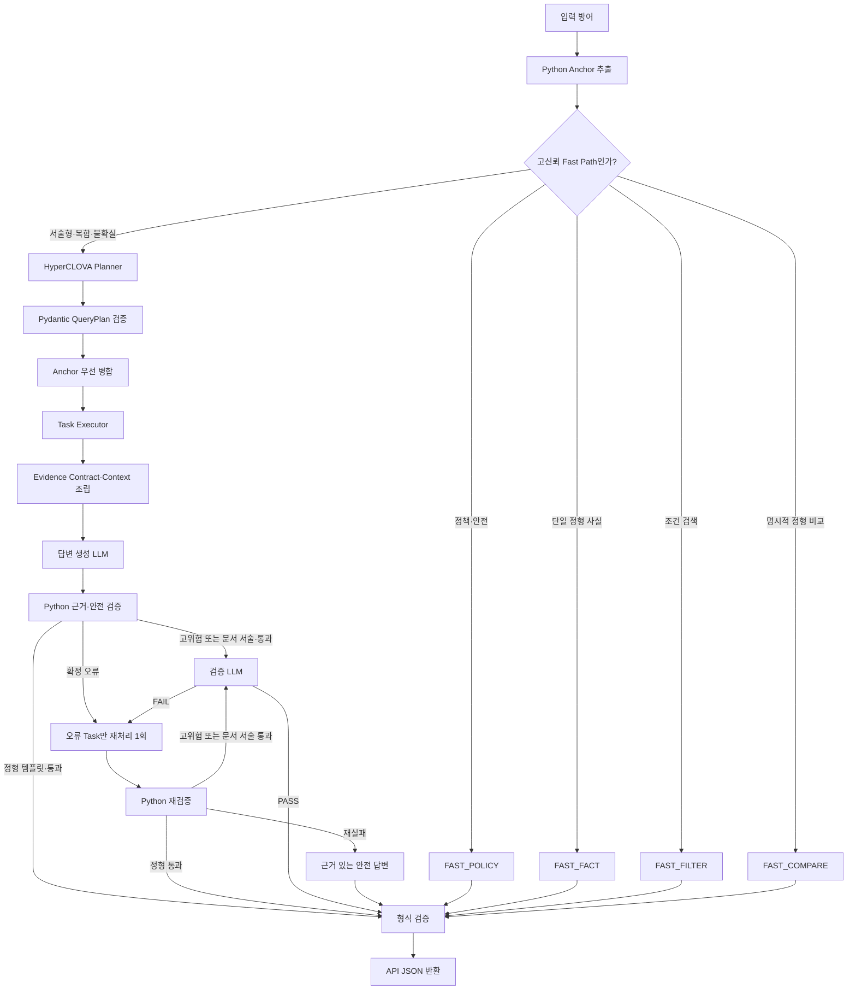

# AI-Pension Agent v2 실행 구조

## 핵심 원칙

Python은 질문에서 확정 가능한 상품코드, 명시된 수치·기간·필터, 반환 범위,
대상을 `QueryAnchor`로 잠근다. 문서 종류는 힌트이며, HyperCLOVA Planner는 서술형 의미와
실행 Task를 판단하지만 Anchor를 삭제하거나 변경할 수 없다.

## 단계별 책임

1. `anchor.py`
   - 상품명을 `product_code`로 식별한다.
   - `위험등급`, `총보수`, `3년 수익률`처럼 명시된 정형 FactType만 확정한다.
   - 모호한 상품군은 후보만 남기며 여러 상품의 코드를 임의로 고정하지 않는다.
   - 문서 영역은 힌트로 전달한다. Planner가 상품/제도 복합 Task를 결정하며 상품 Task 자체의 코드는 고정한다.

2. `pre_router.py`
   - `FAST_POLICY`, `FAST_FACT`, `FAST_FILTER`, `FAST_COMPARE`만 확정한다.
   - 투자위험, 투자전략, 절차, 의미 설명, 기간이 모호한 비교 등은 `AGENT`로 보낸다.
   - Python 표현 사전에 없는 문장을 임의의 RAG 종류로 직접 보내지 않는다.

3. `query_analyzer.py`와 `plan_merger.py`
   - Planner는 의도, 서술형 FactType, 도구, 실행 순서를 만든다.
   - Pydantic이 출력 스키마를 검증한다.
   - `merge_anchor_plan()`이 Planner 누락을 보완하고 Anchor의 상품코드·필터·기간·검색
     범위를 최종 우선값으로 덮어쓴다.

4. `executor.py` → `task_executor.py` → `product_repository.py`
   - Task 순서·의존성을 지키며 `RESOLVE`, `FACT`, `FILTER`, `COMPARE`, `TAX`, `RAG`, `POLICY`를 실행한다.
   - 정형 지표·기간·클래스는 Task 입력을 사용한다. 질문의 단어를 다시 분석해 덮어쓰지 않는다.
   - 필터는 동일 클래스 행의 교집합이다. 임의 최저 보수와 다른 클래스 수익률을 합치지 않는다.
   - 상품 RAG는 Anchor에 고정된 각 상품코드 범위에서만 검색한다.
   - `allowed_source_types=["product"]`인 질문은 제도 문서를 검색하지 않는다.
   - 상품과 제도가 실제로 함께 필요한 질문만 두 문서 영역을 검색한다.

5. `context_builder.py`, `answer_generator.py`, `validation_gate.py`
   - 중복을 제거한 Evidence만 답변 생성기에 전달한다.
   - 숫자·상품코드·페이지·질문 요구사항은 먼저 Python으로 검증한다.
   - 고위험 LLM 답변과 문서 서술 답변은 의미 검증 LLM을 거친다. Python 숫자 검사만으로 서술의 진위를 검증했다고 보지 않는다.
   - 실패하면 오류 종류에 맞는 Task만 최대 한 번 다시 실행하며, 재실패 시 확인된
     근거만 포함한 안전 답변을 반환한다.

## 경로 판정 예시

| 질문 | 경로 | LLM 호출 |
|---|---|---:|
| 특정 상품 위험등급 | `FAST_FACT` | 0회 |
| 총보수 0.5% 이하 상품 모두 | `FAST_FILTER` | 0회 |
| 두 상품의 명시된 3년 수익률 비교 | `FAST_COMPARE` | 0회 |
| 특정 상품의 주요 투자위험 설명 | Planner → 상품 RAG → 생성 → 의미 검증 | 기본 3회 |
| 예금 만기 자동 재예치 절차 | Planner → 제도 RAG → 생성 → 의미 검증 | 기본 3회 |
| 추천·세제·원금손실 관련 생성 답변 | Planner → 생성 → 고위험 검증 | 2~3회 |

## 반드시 지킬 불변조건

- `null`을 0으로 바꾸지 않는다.
- 상품과 판매 클래스를 섞지 않는다.
- 총보수와 총보수·비용을 같은 지표로 취급하지 않는다.
- 수익률은 같은 기간·기준일끼리만 비교한다.
- 상품 질문의 근거를 다른 상품이나 제도 문서로 대체하지 않는다.
- Planner 실패를 이유로 검색 범위를 자동 확장하지 않는다.
- 재처리는 최대 1회다.
- 사용자에게 내부 추론 원문을 노출하지 않고 실행 단계와 검증 결과만 기록한다.

## 2026-09-06 수정 후 운영 계약

- API는 `runtime.answer_payload` 하나로 진입한다. 예전 상품/제도/세제 자동 우회 경로는 제거했다.
- Fast Path는 전체 문장이 정형 컴파일에 성공할 때만 사용한다. 해석되지 않은 조건이 남으면 Planner로 보낸다.
- Planner가 정형 Task만 구성한 경우에도 같은 조회·템플릿을 사용하여 추가 생성 호출을 하지 않는다.
- 예전 문서 추출 helper는 기존 회귀검사용으로 남지만, 프로덕션 API의 Planner 실패 fallback이 아니다.
- 실패한 계획을 넓은 RAG로 대체하지 않는다. 실행 장애와 자료상 미확인을 구분한다.
- IRP/DC/DB는 명시 가입대상 근거를 요구한다. 퇴직연금이라는 상위 분류만 있으면 불확실 후보로 별도 집계한다.
- 같은 클래스·지표의 요약표/상세표 값이 충돌하면 원래 값들을 표시하고 필터·순위용 확정값으로 사용하지 않는다.
- AUM은 `net_asset_won`을 사용한다. 수익률/AUM 기준일이 데이터에 없으면 생성하지 않는다.
- 기본 세액공제 계산만 역할이 검증된 단일 계좌 입력으로 실행한다. 다른 세목·복수 계좌·특례는 문서 근거와 정보 부족 처리로 넘긴다.
- Context는 예산을 엄격히 지키며 Task/상품별로 분배한다. 같은 페이지의 서로 다른 청크는 유지한다.
- 재처리는 요청 전체가 아니라 오류 Task 범위이며 전체 요청당 최대 1회다. 수정 답변에도 의미/안전 재검증을 적용한다.
- 첫 검사와 재검사 오류는 `think_trace`와 회전 로그 `logs/agent_audit.log`에 남는다. API 키/프롬프트 원문은 로그에 남기지 않는다.
- 실제 usage 응답과 문자 추정치를 구분하고 HTTP 재시도 횟수를 기록한다. 캐시는 5분 TTL 및 DB/프롬프트/청크 버전으로 무효화한다.
- 검색기의 flat fallback은 TF-IDF/SVD다. 사전학습 의미 임베딩으로 교체한 것이 아니며, 현재 백엔드 이름을 근거 메타데이터에 기록한다.

100문항 평가는 `tests/evaluation_100_review_v2.json`에 준비만 되어 있다. 아직 실호출하지 않았으며 결과 품질은 별도 평가가 필요하다.
